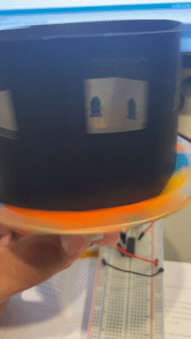

# Zoetrope

## Requirements

- Arduino UNO
- 1 Diode 1N4007
- 2 10 Kilohm Resistors
- 1 Motor
- 2 Switchs
- 1 9v battery
- 1 Battery snap
- 1 Potentiometer
- 1 H-Bridge

## Instructions

Wire up the breadboard and arduino as per the [book](https://store.arduino.cc/products/arduino-starter-kit-multi-language) diagram, and upload the [code](./zoetrope.ino) to your arduino uno.

## Expected outcome

